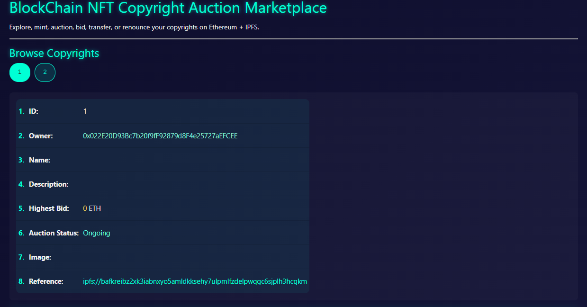
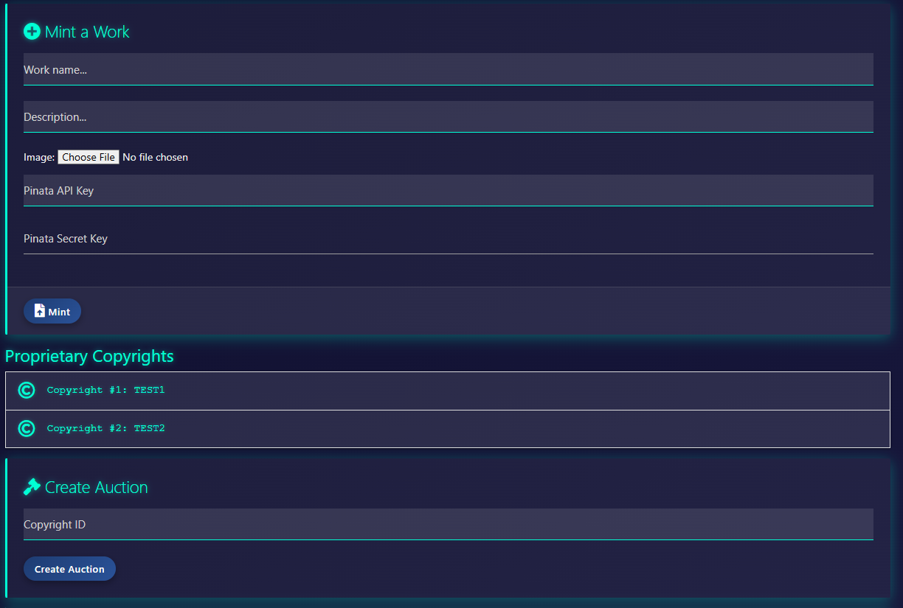
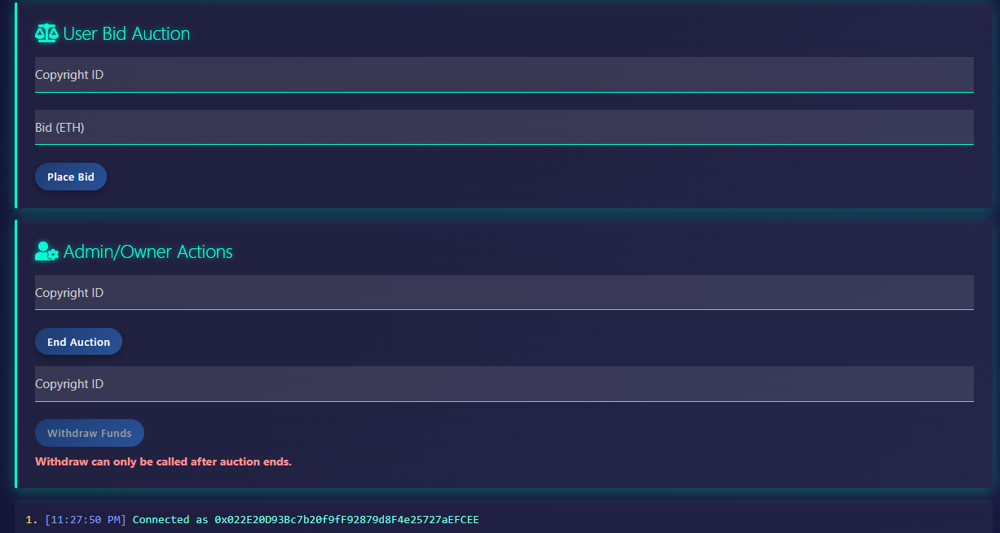
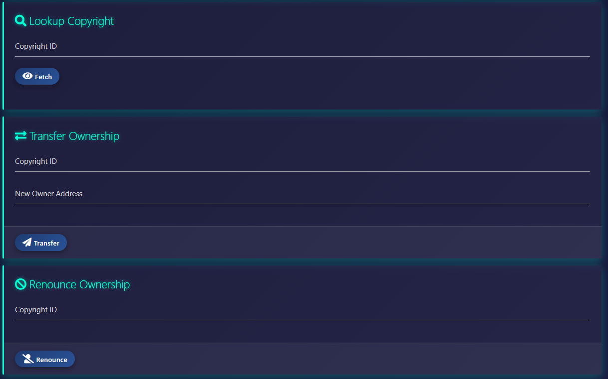

# 🖼️ CryptoRight: Image Copyright NFT Marketplace

## Overview

**CryptoRight** is a decentralized application (dApp) designed for **minting, managing, and auctioning image-based copyrights as NFTs** on the Ethereum blockchain.

Built with Solidity smart contracts and IPFS for decentralized storage, CryptoRight empowers creators to:

- ✅ Mint copyright NFTs linked to original image artwork
- 🔁 Transfer, auction, or renounce copyright ownership
- 🏷️ Participate in real-time copyright auctions with bidding
- 🌐 Share or protect digital works transparently and securely

All actions are executed on-chain and fully compatible with **MetaMask**, ensuring end-to-end decentralization with **IPFS** for image and metadata storage.

---

## Features

- Mint new copyright NFTs with metadata and image stored on IPFS
- Browse all registered copyrights on-chain
- Create and participate in copyright auctions
- Place bids, track auction status and highest bid in real-time
- Transfer or renounce copyright ownership
- Withdraw funds after winning or ending an auction
- Fully decentralized, MetaMask compatible, open-source

## Preparation

1️⃣ **Install MetaMask**  
[https://metamask.io/en-GB/download](https://metamask.io/en-GB/download)

2️⃣ **Get free Sepolia ETH (testnet):**  
- [Google Cloud Faucet](https://cloud.google.com/application/web3/faucet/ethereum/sepolia)  
- [Alchemy Faucet](https://www.alchemy.com/faucets/ethereum-sepolia)

3️⃣ **Register for a free Pinata API key (for IPFS image upload):**  
[https://pinata.cloud/](https://pinata.cloud/)

## Getting Started

1. **Connect MetaMask** to the Sepolia Ethereum network (testnet).
2. **Mint** a copyright NFT by uploading metadata and an image (requires Pinata API keys).
3. **Create auctions**, place bids, and manage your copyrights from the intuitive UI.
4. All actions are powered by Ethereum smart contracts and stored on IPFS.

---

## Deployed Contract

👉 **[Launch CryptoRight dApp](https://winstonpgao.github.io/BlockChain_2/)**

**Contract Address on Sepolia:**  
0x3eef8e212ebbe858c0dd479a294df5e2e47c740a

🔗 [View on Sepolia Etherscan](https://sepolia.etherscan.io/tx/0x4c7351200f23fc5cb167e4532a76d5039cc7cae73e85003f2346d92097b57ed5)

---

## Deploying Your Own Contract (as Admin Role)

1. Use Remix or similar tool to deploy Copyrightmarket.sol on a network ie. Sepolia.
2. Copy deployed contract address to Dapp.js

## Technologies Used

- Solidity smart contracts (ERC721-inspired)
- Ethereum blockchain
- IPFS (via Pinata) for decentralized storage
- JavaScript, Web3.js, Materialize CSS for UI
- GitHub Pages for hosting

---

## Screen Shots:

---

## Part I

Find the basic NFT copyright minting dApp here:  
🔗 [BlockChain (Part I) Repository](https://github.com/winstonpgao/BlockChain/)
